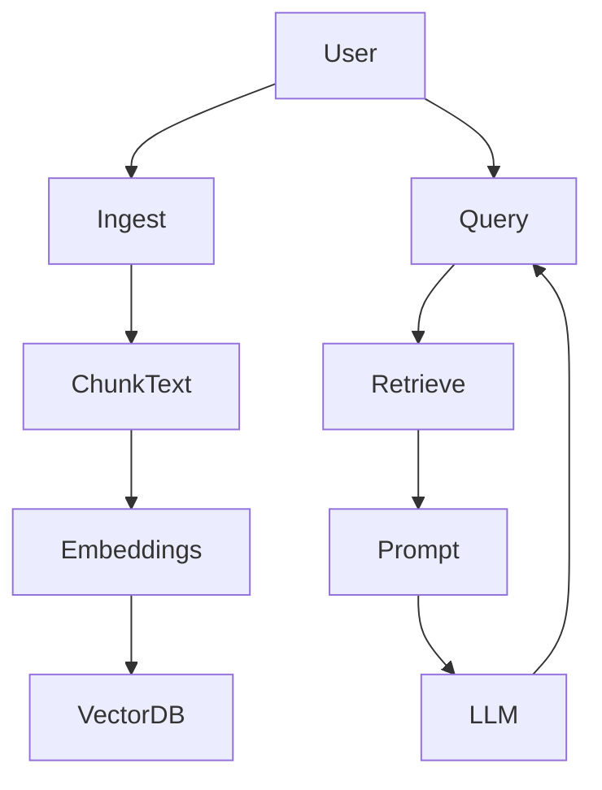

# ISO27001 LLM Reviewer (Prototype)

Prototype ISO27001 policy reviewer using Retrieval-Augmented Generation (RAG): PDF → embeddings → vector search → LLM answer.

This service ingests security/privacy policies as PDF, stores them in a vector database, and answers ISO27001-style questions (e.g. “What does this policy say about A.7 – Human Resource Security?”) using retrieval + LLM (OpenRouter).

---

## Tech Stack

- **Python 3.10+**
- **FastAPI** – backend API
- **Uvicorn** – ASGI server
- **SentenceTransformers** – embeddings (`all-MiniLM-L6-v2`)
- **ChromaDB** – persistent vector store
- **OpenRouter** – LLM access (OpenAI-compatible client)
- **Pydantic** – request/response models
- **pypdf** – PDF text extraction

---

## High-Level Architecture (Mermaid)



---

## Project Structure

```
iso27001-llm-reviewer/
  app/
    main.py             # FastAPI app
    ingest.py           # PDF→text→chunks→embeddings→ChromaDB
    rag.py              # retrieval + prompt + LLM call (OpenRouter)
    models.py           # Pydantic schemas
    config.py           # API keys, paths
    controls.py         # ISO27001 control stubs
  data/
    sample_policies/    # example PDFs
    uploaded/           # runtime uploads
    iso27001_controls.yaml
  vectorstore/          # persistent ChromaDB storage
  requirements.txt
  README.md
```

---

## Setup

```
git clone https://github.com/<your-username>/iso27001-llm-reviewer.git
cd iso27001-llm-reviewer

python -m venv .venv
# Windows
.venv\Scripts\Activate
# macOS / Linux:
# source .venv/bin/activate

pip install --upgrade pip
pip install -r requirements.txt
```

---

## Configure OpenRouter

Create `.env` (not committed to git):

```
OPENROUTER_API_KEY=sk-or-xxxx
```

`config.py` loads it automatically.

---

## Run

```
uvicorn app.main:app --reload
```

API at:
`http://127.0.0.1:8000`

---

## Endpoints

### GET `/health`

Health check.

```
curl http://127.0.0.1:8000/health
```

---

### POST `/ingest`

Upload PDF (Content-Type: multipart/form-data)

Win PowerShell:

```
curl -X POST "http://127.0.0.1:8000/ingest" ^
  -H "accept: application/json" ^
  -H "Content-Type: multipart/form-data" ^
  -F "file=@data/sample_policies/example_policy.pdf"
```

Response:

```json
{
  "file_id": "example_policy",
  "filename": "example_policy.pdf",
  "n_chunks": 9
}
```

---

### POST `/query`

Ask a control-level question:

```
curl -X POST "http://127.0.0.1:8000/query" \
  -H "Content-Type: application/json" \
  -d '{"file_id": "example_policy", "question": "What does this policy say about ISO27001 A.7?"}'
```

Response shape:

```json
{
  "answer": "...",
  "chunks_used": [
    {"page": null, "snippet": "assets that are under their responsibility..."}
  ]
}
```

---

## How It Works

### Ingestion

* Extract text (`pypdf`)
* Chunk by paragraphs (~250 words)
* Encode embeddings (MiniLM)
* Store docs + metadata in ChromaDB (persistent)

### Retrieval

* Detect ISO control (A.5–A.8 stub)
* Build filtered similarity search (file_id
* Retrieve top-k chunks

### RAG Answering

* Build strict prompt with:

  * question
  * relevant ISO description
  * retrieved context
* Call LLM via OpenRouter
* Return summary + quoted fragments + potential gaps

---

## Next Steps / Roadmap

* **QLoRA fine-tuning** on ISO27001 language
* Control-level scoring (covered / partially covered / missing)
* Structured JSON output (instead of plain text only)
* More ISO controls and other frameworks (SOC2, GDPR, PDPA)
* Monitoring, evaluation, and logging
* Better prompt engineering for partial coverage detection


